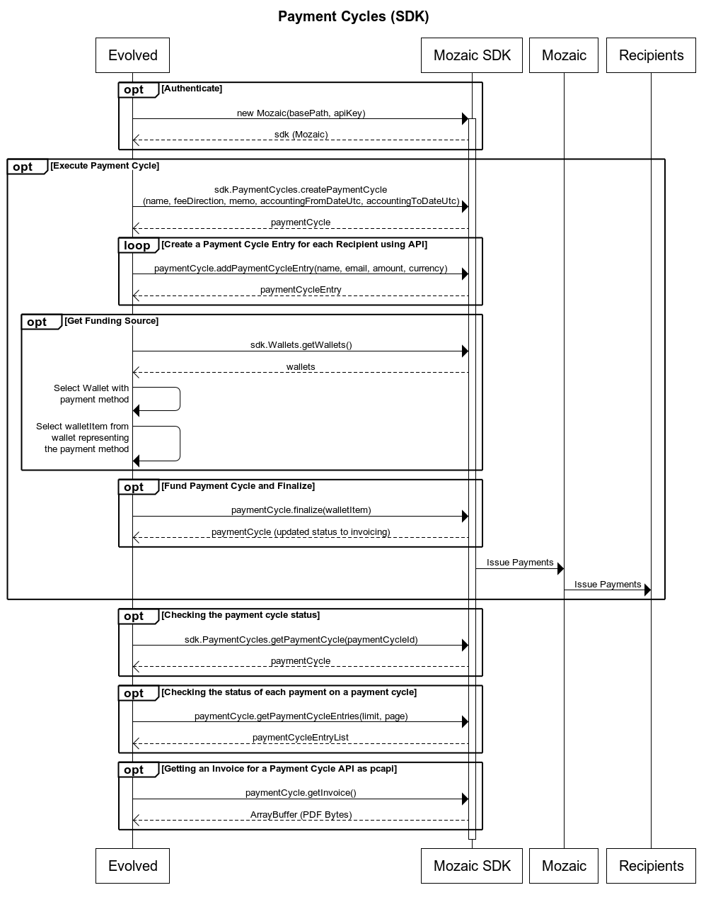

[Back to the SDK](../index.md)

# PaymentCycles (Resource)
As a company or individual who is going to make a one-time payment of varying amounts to various individuals will create a Payment Cycle. A Payment Cycle has an accounting time period that covers a date range, a memo and a name. These fields can be used for accounting so that the payments for a specific time period can be tracked. A payment cycle goes through several stages. While a payment cycle is in draft, you can continue to make changes to it and add additional payment recipients to it as payment cycle entries. Once you have set all of the details for a payment cycle, the payment cycle is finalized. When finalizing the payment cycle, you specify how you would like to fund it. There are two options: pay using a payment method on file, or pay via invoice. Paying my method on file enables the payment cycle to be processed immediately. Funds are withdrawn from your payment method, and then distributed to all of the payment cycle entries that you defined. If you are paying by invoice, you will need to work with your bank to wire funds to the virtual bank account shown on the invoice or use the online payment link shown on the invoice. Once the invoice is paid, the money is distributed to the recipients defined in the payment cycle entries. You can also view the results of a payment cycle using the Mozaic web app. Refer to the [main documentation page](../index.md) for a list of environments.

## Sequence Diagram of a Payment Cycle


## Example Use Case
A company would like to pay a list of creators for the month of October. The period will be from October 1st, 2024 to October 31st, 2024. The title will be “October Payments 2024” and the memo will be “Payments for October 1st through October 31st, 2024”. 

To create this payment cycle, follow the steps in the Sequence Diagram above which will be illustrated below.

### Create a Payment Cycle

```
const sdk = new Mozaic(<End Point>, <Personal Access Token>); 
const paymentCycle = PaymentCycles.createPaymentCycle(
    "October Payments 2024", // Title
    "default", // Fee Direction
    "Payments for October 1st through October 31st, 2024", // Memo
    new Date("10/1/2024"), // accounting period start
    new Date("10/31/2024") // accounting period end
    );
```

### Add Payment Entries to the Payment Cycles
Now that a Payment Cycle has been created, you will add Payment Cycle Entries to the Payment Cycle. Each Payment Cycle Entry represents a single, one-time payment that will be made to the email address specified. This information can be uploaded to the API via a CSV file using the below API endpoint, or you can add Payment Cycle Entries via API calls for item-by-item entry. An optional external id can be associated with the payment recipient as well as a memo that will be visible to the recipient for each payment. Note: If your recipient's email changes, but you use the same external id, Mozaic will continue to send payments to the original email address. Your payment recipient will need to update their email address through Mozaic's web or mobile applications if they wish to receive payments to a new email address. You can also add an External ID and Memo to each Payment Cycle Entry. This information will also be attached the payments that the system generates and the Memo field will be visible to the payment recipient. 

```
const entry1 = await paymentCycle.addPaymentCycleEntry("Jamie Johnson", "jamie.johnson@noemail.com", 200, "USD", "EXT-12345", "This is a payment to Jamie for the mic stand.");

const entry2 = await paymentCycle.addPaymentCycleEntry("Pat Jones", "pat.jones@noemail.com", 100, "AUD", "EXT-54321", "This is a payment for the tour bus");
```

### Funding a Payment Cycle with a stored Payment Method
After a Payment Cycle has been created and Payment Cycle Entries have been added to it, the Payment Cycle must be funded so that Payments can be sent to Recipients. If you would like to use a stored debit card or bank account to fund a Payment Cycle, a Payment Method must be selected from your Wallet using the Wallet API. Once finalized, the payment cycle will be processed and payment recipients will be paid. 

```
const wallets = await sdk.Wallets.getWallets();
const stripeWallet = wallets.find((value) => value.key == "stripe-us");
let paymentMethod = stripeWallet?.paymentMethods.find((value) => value.default == true);

if(paymentMethod === undefined 
    && (stripeWallet?.paymentMethods.length ?? 0 > 0))
    {
        paymentMethod = stripeWallet?.paymentMethods[0];
    }

paymentCycle = paymentCycle.finalize(paymentMethod);
```

### Funding a Payment Cycle with an Invoice
If you would prefer to fund your payment cycle manually, you can do so by paying a Mozaic invoice. Once finalized, you will need to download the invoice and then work with your bank to send payment to the virtual account specified in the Mozaic invoice. If you would like to test this workflow in a non-production environment, please see the example in the [Invoices](Invoices.md) resource.
```
const finalizedPaymentCycle = await paymentCycle.finalizeByInvoice();

const pdfInvoice = await sdk.Invoices.getInvoice(paymentCycle.invoiceId);

fs.writeFileSync("invoice.pdf", Buffer.from(pdfInvoice));
```

### Get the status of the Payment Cycle while it is being processed
The Payment Cycle is sent to a Mozaic payment partner for fulfillment. The payment partner depends on the Wallet you selected above. When the partner updates the payment cycle status, we make that available to you by updating the status in our records. You can get the overall status of the Payment Cycle, or the individual status of each payment that the Payment Cycle will issue. Note that bigger Payment Cycles can take several minutes to complete, please do not make calls less than 5 minutes apart to the API looking for immediate status. To get real time status, we recommend that you use a [web hook](../webhooks.md) instead of polling the Mozaic SDK/API.

```
const currentPaymentCycle = sdk.PaymentCycles.getPaymentCycle(oldPaymentCycle.paymentCycleId);

// Assumes that you have less than 100 entries on your payment cycle.
const currentPaymentCycleEntries = (await currentPaymentCycle).getPaymentCycleEntries(100, 1);
```

Note: If you have more than 100 entries on a single payment cycle, you will need to page through the results to view them all. 

### Get the Invoice for a completed Payment Cycle
When a Payment Cycle has been completed, you can retrieve an Invoice for your funding payment. The Payment Cycle has a convenience method, or you can use the Invoice resource with the invoice ID. The return value from this method is an ArrayBuffer containing the bytes of a PDF. 

```
// Use the convenience method
const invoice2 = paymentCycle.getInvoice();
fs.writeFileSync("invoice2.pdf", Buffer.from(invoice1));

// Or use the resource directly
const invoice1 = await sdk.Invoices.getInvoice(paymentCycle.invoiceId);
fs.writeFileSync("invoice1.pdf", Buffer.from(invoice1));
```


