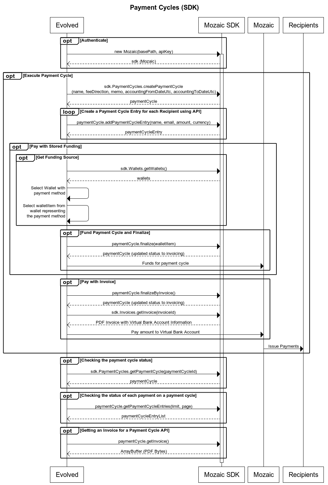

[Back to the SDK](../index.md)

# PaymentCycles (Resource)
As a company or individual who is going to make a one-time payment of varying amounts to various individuals will create a Payment Cycle. A Payment Cycle has an accounting time period that covers a date range, a memo and a name. These fields can be used for accounting so that the payments for a specific time period can be tracked. 

## Sequence Diagram of a Payment Cycle


## Example Use Case
A company would like to pay a list of creators for the month of October. The period will be from October 1st, 2024 to October 31st, 2024. The title will be “October Payments 2024” and the memo will be “Payments for October 1st through October 31st, 2024”. 

To create this payment cycle, follow the steps in the Sequence Diagram above which will be illustrated below.

### Create a Payment Cycle

```
const sdk = new Mozaic(<End Point>, <Personal Access Token>); 
const paymentCycle = PaymentCycles.createPaymentCycle(
    "October Payments 2024", // Title
    "default", // Fee Direction
    "Payments for October 1st through October 31st, 2024", // Memo
    new Date("10/1/2024"), // accounting period start
    new Date("10/31/2024") // accounting period end
    );
```

### Add Payment Entries to the Payment Cycles
Now that a Payment Cycle has been created, you will add Payment Cycle Entries to the Payment Cycle. Each Payment Cycle Entry represents a single, one-time payment that will be made to the email address specified. This information can be uploaded to the API via a CSV file using the below API endpoint, or you can add Payment Cycle Entries via API calls for item-by-item entry.

```
const entry1 = await paymentCycle.addPaymentCycleEntry("Jamie Johnson", "jamie.johnson@noemail.com", 200, "USD");

const entry2 = await paymentCycle.addPaymentCycleEntry("Pat Jones", "pat.jones@noemail.com", 100, "AUD");
```

### Select a Funding Source for the Payment Cycle
After a Payment Cycle has been created and Payment Cycle Entries have been added to it, the Payment Cycle must be funded so that Payments can be sent to Recipients. In order to fund a Payment Cycle, a Payment Method must be selected from your Wallet using the Wallet API. 

```
const wallets = await sdk.Wallets.getWallets();
const stripeWallet = wallets.find((value) => value.key == "stripe-us");
let paymentMethod = stripeWallet?.paymentMethods.find((value) => value.default == true);

if(paymentMethod === undefined 
    && (stripeWallet?.paymentMethods.length ?? 0 > 0))
    {
        paymentMethod = stripeWallet?.paymentMethods[0];
    }
```

### Fund and Finalize the Payment Cycle
Next, Finalize the Payment Cycle which will transfer money from your Payment Method to Mozaic. Once Mozaic has your funding payment, we will proceed to Pay all of the recipients on your Payment Cycle. Note that this call returns an updated paymentCycle object that reflects the status change from "draft" to "invoicing".

```
paymentCycle = paymentCycle.finalize(paymentMethod);
```

### Get the status of the Payment Cycle while it is being processed
The Payment Cycle is sent to a Mozaic payment partner for fulfillment. The payment partner depends on the Wallet you selected above. When the partner updates the payment cycle status, we make that available to you by updating the status in our records. You can get the overall status of the Payment Cycle, or the individual status of each payment that the Payment Cycle will issue. Note that bigger Payment Cycles can take several minutes to complete, please do not make calls less than 5 minutes apart to the API looking for immediate status. 

```
const currentPaymentCycle = sdk.PaymentCycles.getPaymentCycle(oldPaymentCycle.paymentCycleId);

// Assumes that you have less than 100 entries on your payment cycle.
const currentPaymentCycleEntries = (await currentPaymentCycle).getPaymentCycleEntries(100, 1);
```

Note: If you have more than 100 entries on a single payment cycle, you will need to page through the results to view them all. 

### Get the Invoice for a Payment Cycle
When a Payment Cycle has been completed, you can retrieve an Invoice for your funding payment. The Payment Cycle has a convenience method, or you can use the Invoice resource with the invoice ID. The return value from this method is an ArrayBuffer containing the bytes of a PDF. 

```
// Use the convenience method
const invoice2 = paymentCycle.getInvoice();
fs.writeFileSync("invoice2.pdf", Buffer.from(invoice1));

// Or use the resource directly
const invoice1 = await sdk.Invoices.getInvoice(paymentCycle.invoiceId);
fs.writeFileSync("invoice1.pdf", Buffer.from(invoice1));
```


